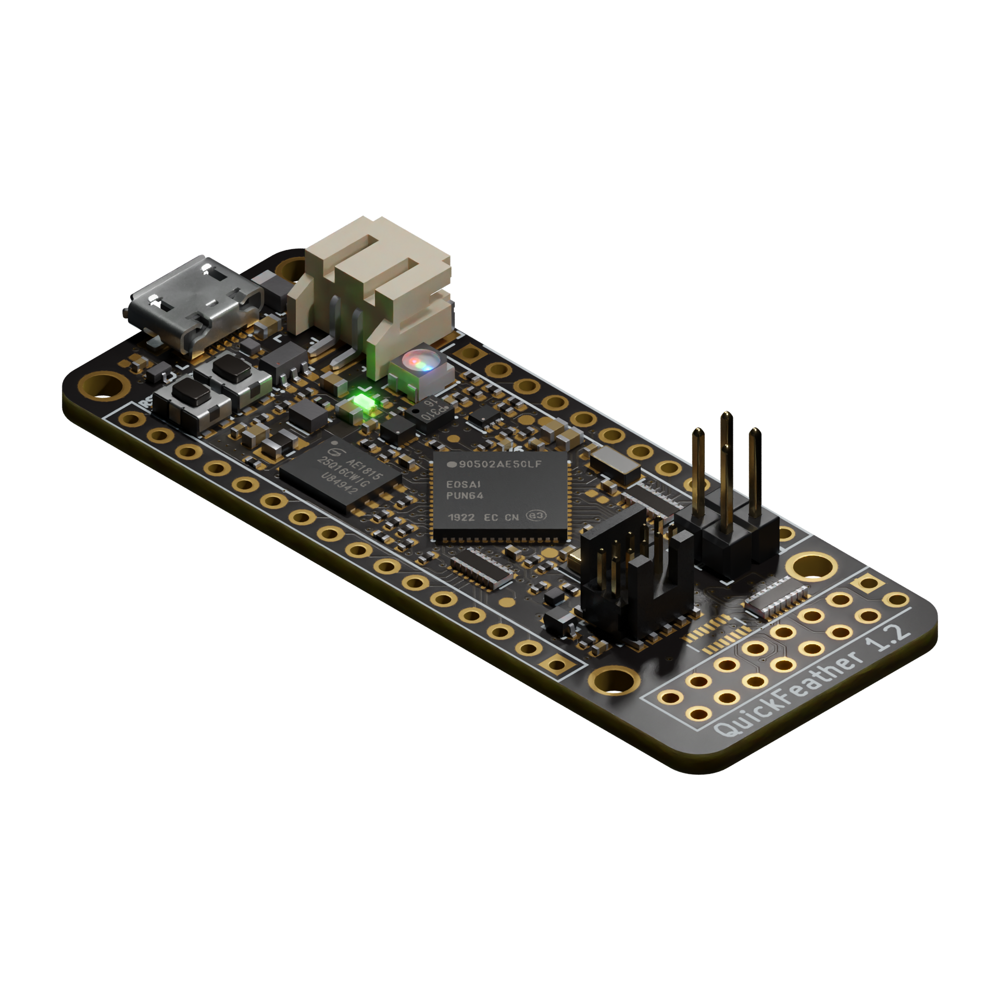

# QuickFeather Development Board

Copyright (c) 2019-2024 [Antmicro](https://www.antmicro.com)

## Overview

This project contains open hardware design files for the [QuickFeather development board](https://www.quicklogic.com/products/eos-s3/quickfeather-development-kit/) based on the QuickLogic [EOS S3 Sensor Processing Platform](https://www.quicklogic.com/products/eos-s3/).
The design files were created by [Antmicro](https://www.antmicro.com) in cooperation with [QuickLogic](https://www.quicklogic.com/).
The board has been designed to keep compatibility with the [Adafruit Feather](https://learn.adafruit.com/adafruit-feather/feather-specification) ecosystem of evaluation boards.
This allows the user to explore functionalities of the EOS S3 platform.

### Project structure:

The main directory contains the KiCad design files, LICENSE and README.
The remaining files are stored in the following directories:

* ``img`` - contains graphics for this README
* ``doc`` - contains generated schematics and other documentation
* ``lib`` - contains KiCad component library

## Key features

* QuickLogic EOS S3 Processing Platform
* [mCube MC3635](https://www.memsic.com/Public/Uploads/uploadfile/files/20220119/MC3635Datasheet.pdf) accelerometer
* [Infineon DPS310](https://www.infineon.com/dgdl/Infineon-DPS310-DataSheet-v01_01-EN.pdf?fileId=5546d462576f34750157750826c42242) pressure sensor
* [Infineon IM69D130](https://www.infineon.com/dgdl/Infineon-IM69D130-DS-v01_00-EN.pdf?fileId=5546d462602a9dc801607a0e46511a2e) MEMS microphone 
* 16Mbit of on-board [flash memory](https://www.gigadevice.com.cn/Public/Uploads/uploadfile/files/20220714/DS-00086-GD25Q16C-Rev3.2.pdf)
* User button and RGB LED
* Powered from USB or a single Li-Po battery
* Integrated [battery charger](http://ww1.microchip.com/downloads/en/DeviceDoc/20001984g.pdf)
* USB data signals tied to programmable logic
* IO signals break-routed into general purpose pinheads
* Compatible with standard 0.1" breadboards

## Development ecosystem

### Simulation

The board is supported in [Renode](https://renode.io/), the open source simulation framework by Antmicro - you can run a virtual copy of this hardware for software development purposes on your PC. A link to the relevant demo script is provided in Renode's [supported boards section](https://renode.readthedocs.io/en/latest/introduction/supported-boards.html).

## License

This project is licensed under the [CC BY-SA 4.0 DEED](LICENSE) license.
